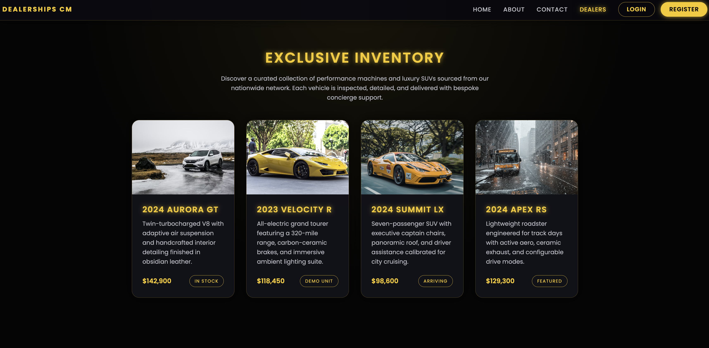
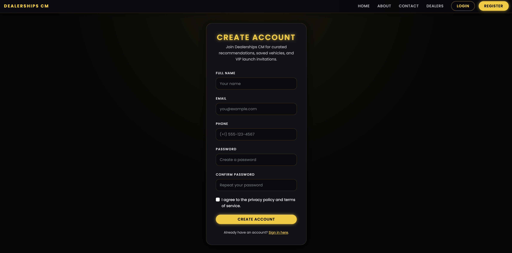
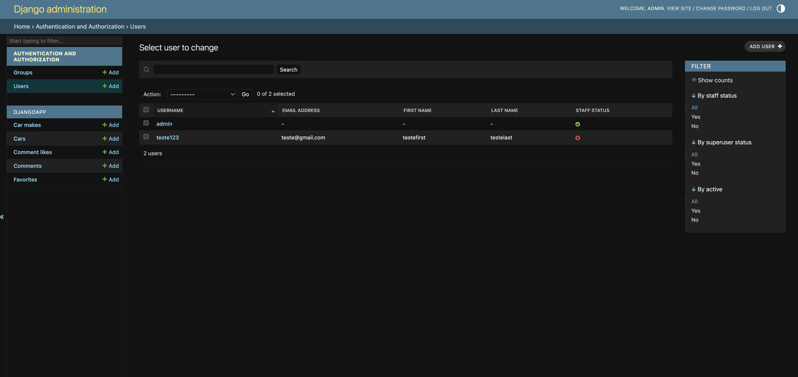

# 🚗 Car Dealerships CM

A **Full-Stack Application** para gerenciamento de concessionárias de carros de luxo e performance, construída com **Django (backend)** e **React (frontend)**.  

- O sistema conta com **login, registro, listagem de veículos, favoritos, comentários e painel administrativo** para controle completo.

---

## 🖥️ Tech Stack

- **Frontend**: React.js, HTML5, CSS3, JavaScript (ES6+)
- **Backend**: Django, Django REST Framework
- **Banco de Dados**: SQLite (dev) / PostgreSQL (produção)
- **Autenticação**: Django Auth
- **Estilo**: CSS customizado com tema escuro e destaque neon amarelo
- **Versionamento**: Git + GitHub

---

## Preview

- **Car Inventory (Dealers Page)**  
  

- **Register Page**  
  

- **Admin Panel**  
  

---

## ⚙️ Funcionalidades

### 🔑 Autenticação
- Registro de usuários com nome, email, telefone e senha. (DONE)
- Login seguro com persistência de sessão. (DONE)
- Perfil do usuário com carros salvos e comentários. (In Progress)
- Sistema de **administração** para visualizar e gerenciar usuários. (DONE)

### 🚘 Inventário de Carros
- Exibição de um **inventário exclusivo** de veículos (carros de luxo, SUVs, esportivos). (DONE)
- Informações detalhadas como preço, ano, status (em estoque, demo, chegando). (DONE)
- Possibilidade de adicionar novos veículos via **painel admin**. (DONE)

### 💬 Comentários e Interações
- Usuários logados podem comentar nos carros. (In Progress)
- Sistema de **likes em comentários**. (In Progress)
- Apenas usuários autenticados podem interagir. (In Progress)

### ⭐ Favoritos
- Usuários logados podem salvar carros como favoritos. (In Progress)
- Favoritos ficam armazenados no perfil de cada usuário. (In Progress)

### 🛠️ Painel Administrativo
- Controle completo via **Django Admin**:
    - Gerenciar usuários (editar, excluir, definir permissões). (DONE)
    - Gerenciar inventário de veículos. (DONE)
    - Gerenciar comentários, curtidas e favoritos. (DONE)

---

## 🚀 Como rodar o projeto

### 1️⃣ Clone o repositório
```
git clone https://github.com/cmontilha/Car-Dealerships-CM.git
cd Car-Dealerships-CM
```
### 2️⃣ Backend (Django)
```
cd server
python3 -m venv djangoenv
source djangoenv/bin/activate
pip install -r requirements.txt
```
Rodar as migrações:
```
python manage.py migrate
```
Criar superusuário:
```
python manage.py createsuperuser
```
Rodar servidor backend:
```
python manage.py runserver
```
### 3️⃣ Frontend (React)
```
cd frontend
npm install
npm start
```
### 4️⃣ Acesse a aplicação
```
- Frontend: http://localhost:3000
- Backend/Admin: http://127.0.0.1:8000/admin
```

---

## 📌 Como usar
- Crie uma conta na página **Register**.
- Faça login e acesse a página **Dealers** para explorar os carros.
- Favorite e comente em veículos.
- Entre no **Admin Panel** (usuário admin) para gerenciar tudo.

---

## ⚠️ Status
Este projeto ainda está em **fase de desenvolvimento**.  
Novos recursos planejados incluem:
- Filtros avançados de busca.
- Finalizar favoritar func e user profile.
- Chat em tempo real entre clientes e dealers.
- Perfis de usuários com histórico de compras e favoritos.

Se quiser testar localmente, basta seguir as instruções acima.

---

##  Licença
Este projeto está sob a **MIT License** – veja o arquivo LICENSE para mais detalhes.
